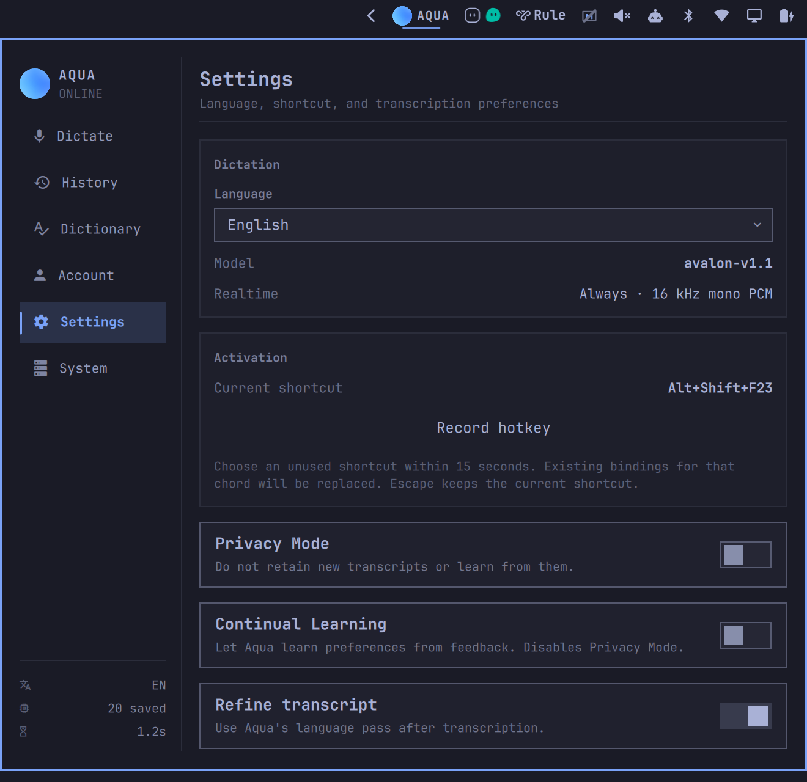

# Aqua Voice for Omarchy

Voice dictation with a native Omarchy panel, a floating recording overlay, and automatic paste.

**Unofficial community project. The Aqua Voice team is working on an official Linux client.** Requires an Aqua Voice account.



<details>
<summary>Recording overlay</summary>


</details>

## Install

Requires Omarchy with Lua Hyprland bindings, PipeWire, and a working Secret Service keyring.

Install Bun with `mise use -g bun`. Required Arch packages: `base-devel`, `jq`, `wl-clipboard`, `wtype`, `pipewire-audio`, `libsecret`, and `xdg-utils`.

Copy the command below and paste it into your terminal. Once listed on the [Omarchy marketplace](https://plugins.omarchy.org/), you can also use **Copy install command** on the Aqua Voice card.

```bash
omarchy plugin add https://github.com/Frank-III/omarchy-aqua-voice --enable
```

Click the Aqua bar icon, review the setup summary, then **Install and enable**. If another app handles Aqua login links, an unchecked option lets you switch them to this client. Missing dependencies appear in the panel.

Terminal alternative: `bash ~/.config/omarchy/plugins/frankmi.aqua-voice/install.sh`.

## Use

1. Open **Aqua Voice** from App Finder or the bar.
2. Sign in under **Account**.
3. Choose a shortcut under **Settings → Record hotkey**.
4. Double-tap to record; tap once to finish and paste. **Escape** cancels.

The panel also has start/finish buttons. **Dictionary** manages words, replacements, and writing instructions; **History** keeps your last 20 dictations.

Global shortcuts require read access to keyboard devices in `/dev/input/`. The `input` group can provide this, but grants access to other keyboard events too. Access is never granted automatically; panel buttons work without it.

Preferences live in `~/.config/aqua-voice/settings.json`; previous `~/.config/Aqua Voice/settings.json` files are never changed by the default client.

Audio goes to Aqua for transcription and is not saved locally. Login uses the keyring. **Privacy Mode** stops new local history entries.

## Update

Run while not dictating:

```bash
omarchy plugin update frankmi.aqua-voice
cd ~/.config/omarchy/plugins/frankmi.aqua-voice
./install.sh
systemctl --user restart aqua-voice.service
```

Rerun the installer if you remove the Bun version used at installation.

## Remove

Sign out in **Account** first to remove your saved login, then:

```bash
systemctl --user disable --now aqua-voice.service
omarchy plugin remove frankmi.aqua-voice
```

To restore a replaced login handler, run `aqua-voice-control restore-login-handler` before removal. It preserves any newer handler choice you made.

This leaves local settings/history, backend files in `~/.local/lib/aqua-voice`, the control script, and desktop entries in place.

## Troubleshooting & development

```bash
aqua-voice-control status
journalctl --user -u aqua-voice.service -n 50 --no-pager
bun test
omarchy plugin validate .
```

[Implementation notes](AQUA_UI.md) · [Release checks and known limits](RELEASE_CHECKLIST.md) · [MIT license](LICENSE)

Thanks to the [Aqua Voice team](https://aquavoice.com) for building Aqua Voice and providing protocol guidance and feedback that helped improve this community client.

Aqua Voice branding belongs to Aqua Voice; the orb comes from [their website](https://aquavoice.com/images/icons/orb-128.png).
